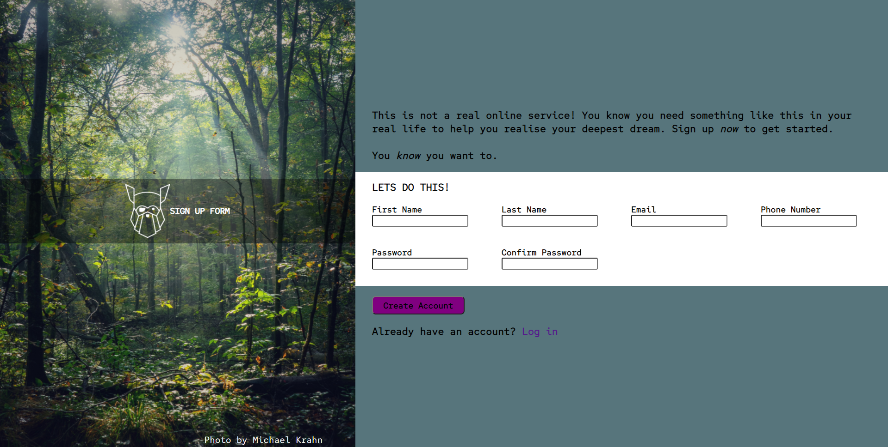

Sign up form project from The Odin Project.

Photo used is by Michael Krahn on upsplash.

Try it with the link at the side and let me know if theres any problem or places i can improve on

# Sample

# About
A simple form that checks
-  Any value for first and last name
-  valid email address
-  Any length for phone number
-  Matching between Password and Confirm Password

# Links
[The project details](https://www.theodinproject.com/paths/full-stack-javascript/courses/intermediate-html-and-css/lessons/sign-up-form)